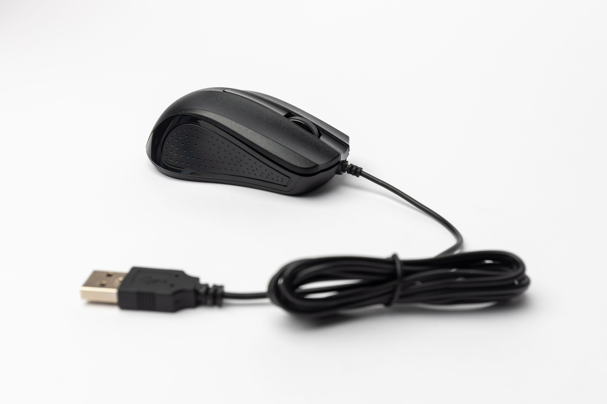
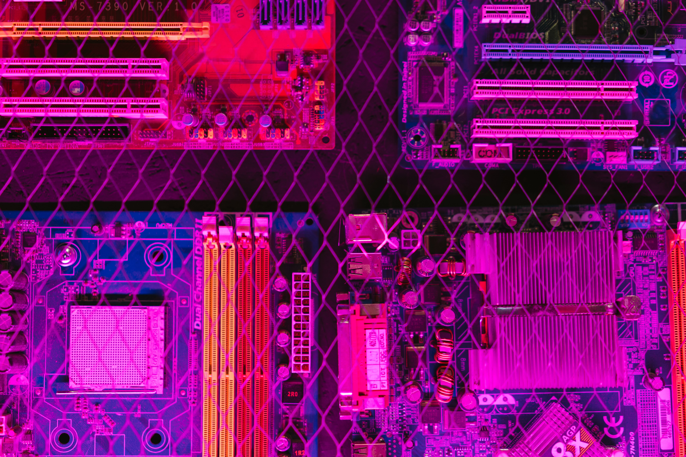
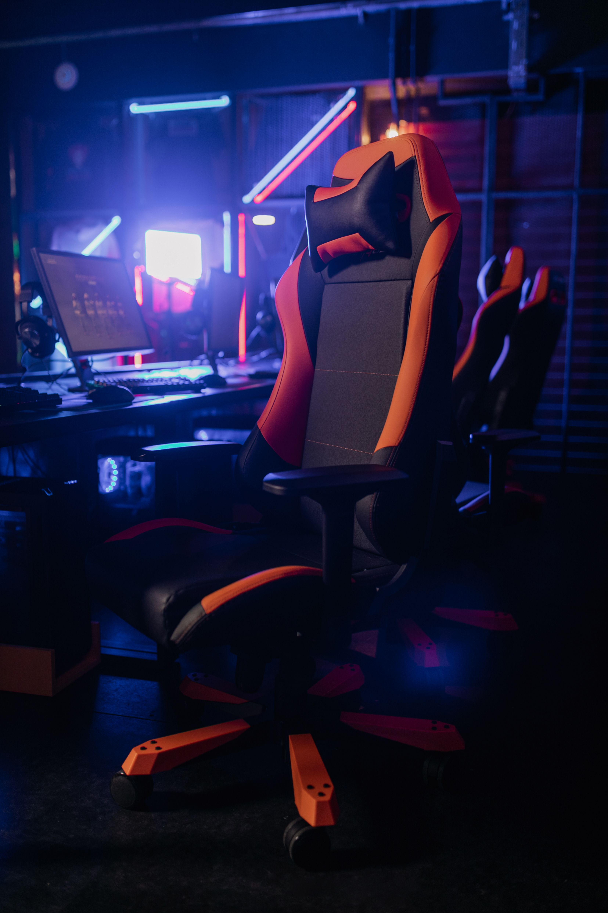

# Ex.No:08 Responsive Web Design using Bootstrap
# Date:4/09/2026
# AIM:
To create a simplified clone of Dribbble (https://dribbble.com/) landing page.

# DESIGN STEPS:
## Step 1:
Clone the repository from GitHub.

## Step 2:
Create Django Admin project.

## Step 3:
Create a New App under the Django Admin project.

## Step 4:
Insert the necessary CSS and JavaScript files as external in order to use Bootstrap.

## Step 5:
Create a HTML file and include the needed Bootstrap components.

## Step 6:
Publish the website in the LocalHost.

# PROGRAM :
~~~
<!DOCTYPE html>
<html>
<head>
    <title>Dribbble</title>
    <link rel="stylesheet" href="https://stackpath.bootstrapcdn.com/bootstrap/4.5.2/css/bootstrap.min.css">
    
</head>
<body>

<header class="navbar">
    

        Dribbble
    

    <nav>
        <ul class="nav-links">
            <li><a href="#" class="active">Inspiration</a></li>
            <li><a href="#">Find Work</a></li>
            <li><a href="#">Learn Design</a></li>
            <li><a href="#">Go Pro</a></li>
            <li><a href="#">Hire Designers</a></li>
        </ul>
    </nav>
    

        <input type="text" class="search" placeholder="Search shots...">
        <a href="#">Sign in</a>
        <a href="#" class="btn btn-sm sign-up">Sign up</a>
    

</header>

<section class="sub-header">
    <h1>Discover the world’s top designers & creatives</h1>
    
Dribbble is the leading destination to find & showcase creative work and home to the world's best design professionals.

    

        <button class="sign-up">Sign up</button>
        <button class="learn-more">Learn more</button>
    

</section>

<section class="filter-bar">
    

        <select>
            <option>Popular</option>
            <option>Newest</option>
        </select>
        <select>
            <option>All Shots</option>
            <option>PC Setups</option>
            <option>Components</option>
            <option>Accessories</option>
        </select>
    

    <select>
        <option>Now</option>
        <option>This Week</option>
        <option>This Month</option>
        <option>All Time</option>
    </select>
</section>

<main class="grid">
    

        

            
            <!-- Card 1 -->
            

                

                    

                        
                    

                    

                        

                            P
                            PC Master
                        

                        

                            👁 4.2k
                            ♥ 512
                        

                    

                

            

            <!-- Card 2 -->
            

                

                    

                        
                    

                    

                        

                            T
                            Tech Byte
                        

                        

                            👁 3.6k
                            ♥ 436
                        

                    

                

            

            <!-- Card 3 -->
            

                

                    

                        
                    

                    

                        

                            P
                            Pixel Setup
                        

                        

                            👁 2.9k
                            ♥ 312
                        

                    

                

            

            <!-- Card 4 -->
            

                

                    

                        
                    

                    

                        

                            K
                            Keys & Clicks
                        

                        

                            👁 3.2k
                            ♥ 408
                        

                    

                

            

            <!-- Card 5 -->
            

                

                    

                        
                    

                    

                        

                            G
                            Gear Lab
                        

                        

                            👁 3.7k
                            ♥ 298
                        

                    

                

            

            <!-- Card 6 -->
            

                

                    

                        
                    

                    

                        

                            B
                            Board Builder
                        

                        

                            👁 2.3k
                            ♥ 243
                        

                    

                

            

            <!-- Card 7 -->
            

                

                    

                        
                    

                    

                        

                            C
                            Comfort Gear
                        

                        

                            👁 2.1k
                            ♥ 187
                        

                    

                

            

        

    

</main>

</body>
</html>
~~~

# OUTPUT:

# RESULT:
The Project for responsive web design using Bootstrap is completed successfully.
