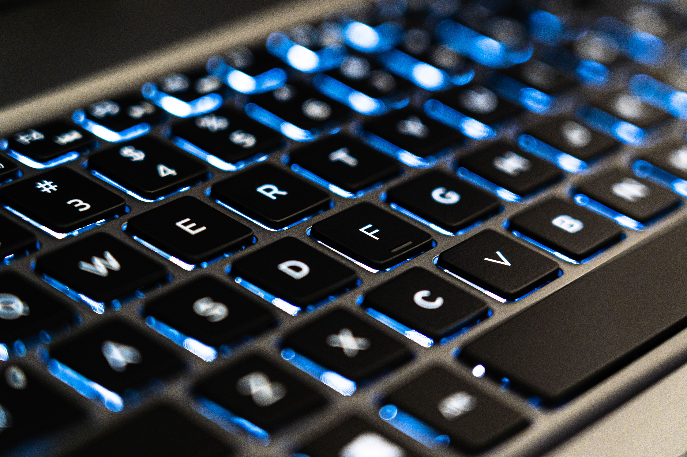

# Ex.No:08 Responsive Web Design using Bootstrap
# Date:4/09/2026
# AIM:
To create a simplified clone of Dribbble (https://dribbble.com/) landing page.

# DESIGN STEPS:
## Step 1:
Clone the repository from GitHub.

## Step 2:
Create Django Admin project.

## Step 3:
Create a New App under the Django Admin project.

## Step 4:
Insert the necessary CSS and JavaScript files as external in order to use Bootstrap.

## Step 5:
Create a HTML file and include the needed Bootstrap components.

## Step 6:
Publish the website in the LocalHost.

# PROGRAM :
~~~
<!DOCTYPE html>
<html>
<head>
    <title>Dribbble</title>

    
</head>

<body>
    <header class="navbar">
        
Dribbble

        <a href="#">Inspiration</a>
        <a href="#">Find Work</a>
        <a href="#">Learn Design</a>
        <a href="#">Go Pro</a>

        <input class="search" type="text" placeholder="Search shots...">

        <a href="#">Sign in</a>
        <button class="sign-up">Sign up</button>
    </header>

    <section class="hero">
        <h1>Discover the world’s top designers & creatives</h1>
        
Find and showcase creative work.

        <button class="sign-up">Sign up</button>
        <button class="learn-more">Learn more</button>
    </section>

    <section class="filters">
        

            <select>
                <option>Popular</option>
                <option>Newest</option>
            </select>

            <select>
                <option>All Shots</option>
                <option>PC Setups</option>
                <option>Accessories</option>
            </select>
        

        <select>
            <option>Now</option>
            <option>This Week</option>
            <option>This Month</option>
        </select>
    </section>

    <main class="grid">
        

            
            

                PC Master
                👁 4.2k ♥ 512
            

        

        

            
            

                Tech Byte
                👁 3.6k ♥ 436
            

        

        

            
            

                Pixel Setup
                👁 2.9k ♥ 312
            

        

        

            
            

                Keys & Clicks
                👁 3.2k ♥ 408
            

        

    </main>
</body>
</html>
~~~

# OUTPUT:

# RESULT:
The Project for responsive web design using Bootstrap is completed successfully.
