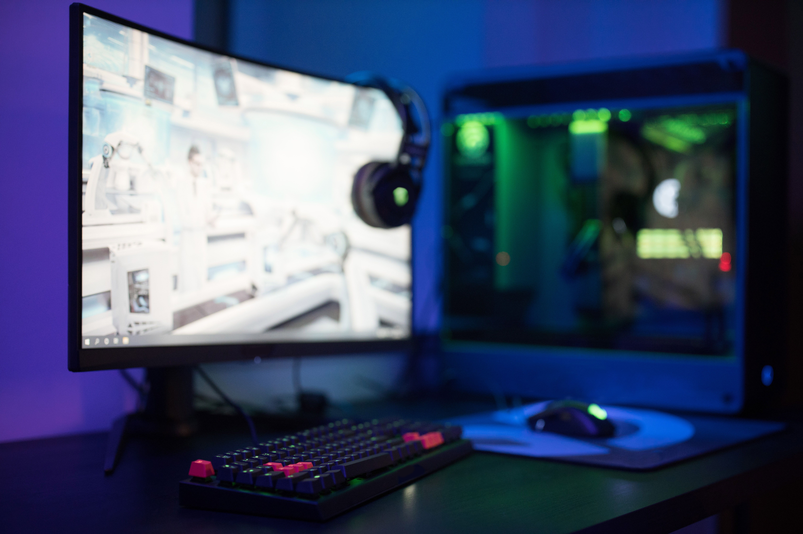
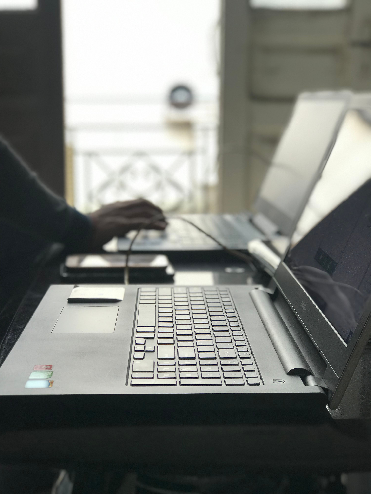
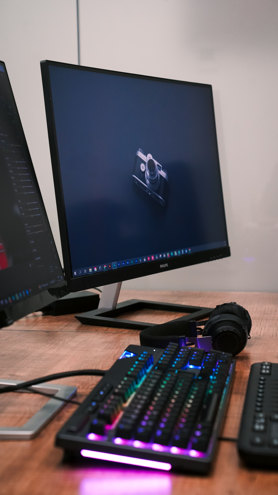
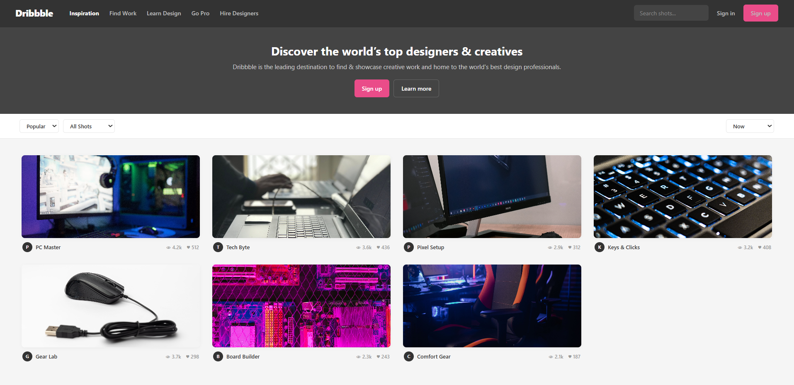

# Ex.No:08 Responsive Web Design using Bootstrap
# Date:4/09/2026
# AIM:
To create a simplified clone of Dribbble (https://dribbble.com/) landing page.

# DESIGN STEPS:
## Step 1:
Clone the repository from GitHub.

## Step 2:
Create Django Admin project.

## Step 3:
Create a New App under the Django Admin project.

## Step 4:
Insert the necessary CSS and JavaScript files as external in order to use Bootstrap.

## Step 5:
Create a HTML file and include the needed Bootstrap components.

## Step 6:
Publish the website in the LocalHost.

# PROGRAM :
~~~
<!DOCTYPE html>
<html>
<head>
    <title>Dribbble</title>

    <link rel="stylesheet"
          href="https://stackpath.bootstrapcdn.com/bootstrap/4.5.2/css/bootstrap.min.css">

    
</head>

<body>
    <header class="navbar d-flex align-items-center">
        <h4>Dribbble</h4>

        

            <a href="#">Inspiration</a>
            <a href="#">Find Work</a>
            <a href="#">Learn Design</a>
        

        <button class="btn pink ml-auto">Sign up</button>
    </header>

    <section class="hero">
        <h1>Discover top designers & creatives</h1>
        
Find and showcase creative work.

        <button class="btn pink">Sign up</button>
        <button class="btn btn-outline-light">Learn more</button>
    </section>

    <section class="filters d-flex justify-content-between">
        <select>
            <option>Popular</option>
            <option>Newest</option>
        </select>

        <select>
            <option>All Shots</option>
            <option>PC Setups</option>
        </select>
    </section>

    <main class="container mt-4">
        

            

                

                    
                    

                        <b>PC Master</b> — 👁 4.2k ♥ 512
                    

                

            

            

                

                    
                    

                        <b>Tech Byte</b> — 👁 3.6k ♥ 436
                    

                

            

            

                

                    
                    

                        <b>Pixel Setup</b> — 👁 2.9k ♥ 312
                    

                

            

        

    </main>
</body>
</html>
~~~

# OUTPUT:

# RESULT:
The Project for responsive web design using Bootstrap is completed successfully.
